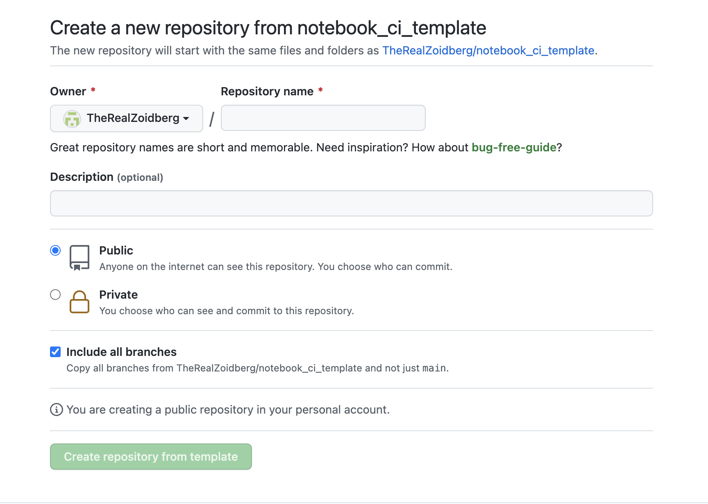
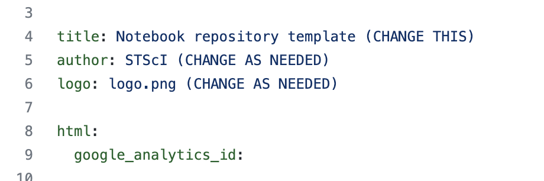
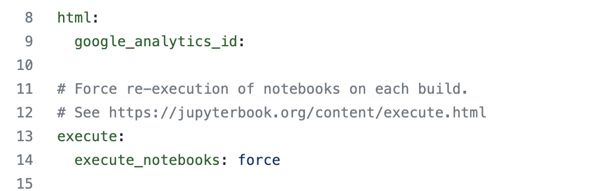
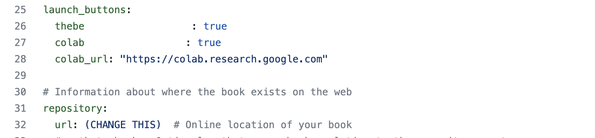
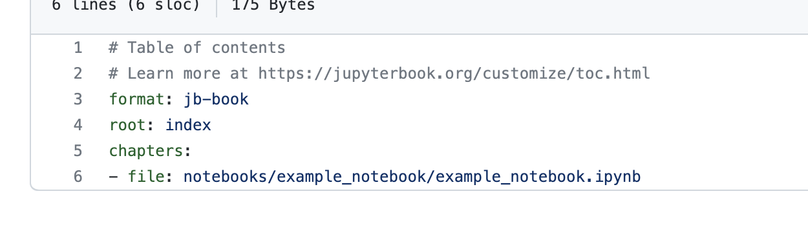

Creating a new notebook CI enabled repository on GitHub

Navigate to: <https://github.com/TheRealZoidberg/notebook_ci_template>

This repository contains all the files needed to set up a CI enabled
GitHub notebook repository, including proper structure, support files,
and configuration files. Note: This template will be moved to a
spacetelescope repo as soon as permissions can be sorted.

Creation of a new repository is simple.

1)  Press the green 'use this template' button on the top right of the
    template repository. {width="6.5in"
    height="4.634027777777778in"}

2)  Enter the new repository name.

3)  Optionally enter a description.

4)  Be sure to CHECK the 'include all branches' box -- this will include
    the 'gh-pages' branch required to generate rendered HTML.

5)  Select 'Create repository from template'

You will now have a new repository set up at
github.com/\<yourRepoHome\>/\<repoName\>

Configuration

There are now a few steps to take to configure your new repository.

[\_config.yml]{.underline}

1)  In the repository root, edit '\_config.yml'

    a.  The config file contains all the build information for
        jupyter-book to build. The config provided contains the very
        basics needed -- there are many more options available to expand
        the configuration and add new functionality. See:
        https://jupyterbook.org/customize/config.html

2)  Edit the config as follows:
    {width="6.388888888888889in"
    height="2.125in"}

    a.  Title -- Change to 'mission name' Notebooks

    b.  Author -- STScI or any specific name

    c.  Logo -- Point to a generated logo for the mission

    d.  {width="6.5in"
        height="2.040277777777778in"}

    e.  If you have an google analytics ID, populate it here, this will
        add tracking to all generated pages for metrics.

    f.  Execute -- Defaults to 'force' -- which will rebuild all pages
        during each jupyter-book run. This can be changed to other
        options, including 'off', 'cache', 'auto' -- options can be
        viewed here: https://jupyterbook.org/content/execute.html

    g.  {width="6.5in"
        height="1.5104166666666667in"}

    h.  Launch_buttons -- enables functionality to allow notebook
        execution either in page, or in an external runner environment.

    i.  Options include:

        i.  Thebe -- uses a mybinder kernel to run notebook cells within
            the generated html pages directly.

        ii. Mybinder -- opens a runner and allows external running of
            the notebook in a standard jupyter format on a mybinder
            runner

        iii. Colab -- similar to mybinder, but uses google colab runner

    j.  Repository -- required for proper links -- enter your repository
        base, example:
        [https://github.com/\<yourRepositoryRoot\>/\<repositoryName](https://github.com/%3cyourRepositoryRoot%3e/%3crepositoryName)\>

[\_toc.yml]{.underline}

The \_toc.yml file is the container for the table of contents, which
includes all notebooks to be generated.

The structure is highly configurable, but the basic setup is as follows:

{width="6.5in" height="1.8305555555555555in"}

The chapters refer to individual notebooks to be included, all notebooks
in the repository do not have to be added. The contents provided will be
the final notebooks that are generated and rendered to HTML.

Additional notebooks can be added using the '-file:
/path/to/notebook.ipynb' structure.

The notebooks provided can be set up to be displayed in the table of
contents in many ways, all options are available to be reviewed here:
<https://jupyterbook.org/customize/toc.html>
