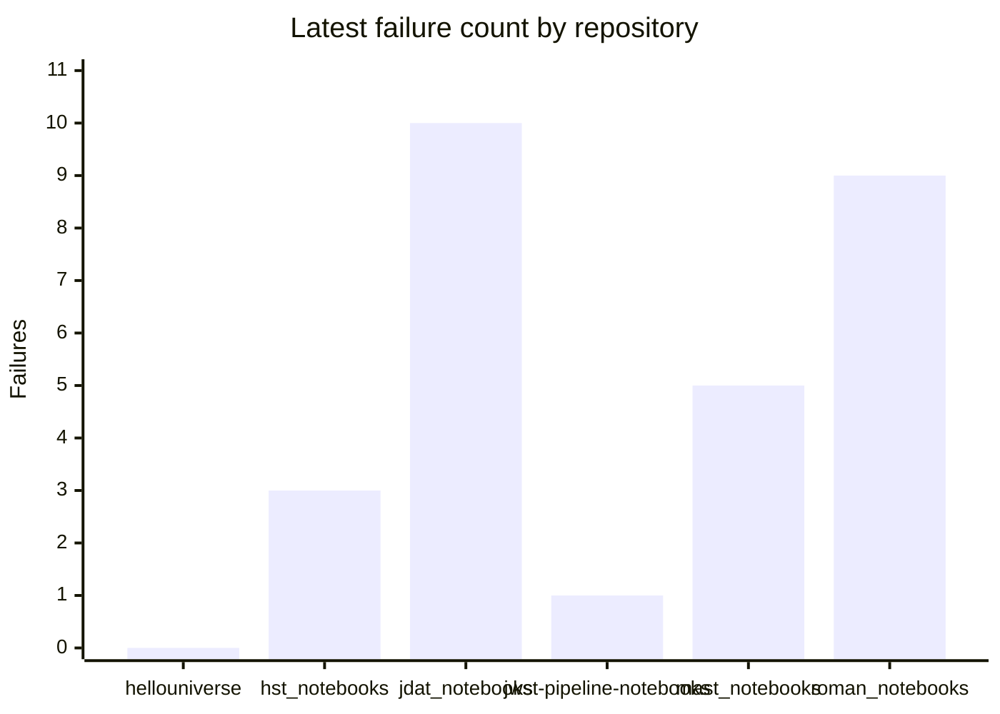

# Notebook CI Dashboard

_Generated 2026-03-19 18:54 UTC_

Workflow tracked: `Notebook CI - Scheduled`

## Executive Summary

| Repository | Latest Failures | New Failures | Resolved | Consistent Failures | Latest Run |
|---|---:|---:|---:|---:|---|
| `spacetelescope/hellouniverse` | 0 | 0 | 0 | 0 | [#30](https://github.com/spacetelescope/hellouniverse/actions/runs/23102195856) |
| `spacetelescope/hst_notebooks` | 3 | 1 | 1 | 2 | [#21](https://github.com/spacetelescope/hst_notebooks/actions/runs/23102221236) |
| `spacetelescope/jdat_notebooks` | 10 | 0 | 0 | 10 | [#19](https://github.com/spacetelescope/jdat_notebooks/actions/runs/23102201298) |
| `spacetelescope/jwst-pipeline-notebooks` | 1 | 0 | 0 | 1 | [#8](https://github.com/spacetelescope/jwst-pipeline-notebooks/actions/runs/23102241381) |
| `spacetelescope/mast_notebooks` | 5 | 0 | 2 | 5 | [#27](https://github.com/spacetelescope/mast_notebooks/actions/runs/23102252114) |
| `spacetelescope/roman_notebooks` | 9 | 0 | 0 | 9 | [#17](https://github.com/spacetelescope/roman_notebooks/actions/runs/23102201256) |

## Latest Failure Count by Repository



## Rolling Trend Table

| Repository | 2026-03-15 |
|---|---:|
| `spacetelescope/hellouniverse` | 0 |
| `spacetelescope/hst_notebooks` | 3 |
| `spacetelescope/jdat_notebooks` | 10 |
| `spacetelescope/jwst-pipeline-notebooks` | 1 |
| `spacetelescope/mast_notebooks` | 5 |
| `spacetelescope/roman_notebooks` | 9 |

## Per-Repository Trends

### `spacetelescope/hellouniverse`

```mermaid
xychart-beta
    title "hellouniverse failure trend"
    x-axis ["2026-03-15"]
    y-axis "Failures" 0 --> 5
    line [0]
```

| Date | Failures | New | Resolved | Consistent | Latest Run |
|---|---:|---:|---:|---:|---|
| 2026-03-15 | 0 | 0 | 0 | 0 | [#30](https://github.com/spacetelescope/hellouniverse/actions/runs/23102195856) |

### `spacetelescope/hst_notebooks`

```mermaid
xychart-beta
    title "hst_notebooks failure trend"
    x-axis ["2026-03-15"]
    y-axis "Failures" 0 --> 5
    line [3]
```

| Date | Failures | New | Resolved | Consistent | Latest Run |
|---|---:|---:|---:|---:|---|
| 2026-03-15 | 3 | 1 | 1 | 2 | [#21](https://github.com/spacetelescope/hst_notebooks/actions/runs/23102221236) |

### `spacetelescope/jdat_notebooks`

```mermaid
xychart-beta
    title "jdat_notebooks failure trend"
    x-axis ["2026-03-15"]
    y-axis "Failures" 0 --> 11
    line [10]
```

| Date | Failures | New | Resolved | Consistent | Latest Run |
|---|---:|---:|---:|---:|---|
| 2026-03-15 | 10 | 0 | 0 | 10 | [#19](https://github.com/spacetelescope/jdat_notebooks/actions/runs/23102201298) |

### `spacetelescope/jwst-pipeline-notebooks`

```mermaid
xychart-beta
    title "jwst-pipeline-notebooks failure trend"
    x-axis ["2026-03-15"]
    y-axis "Failures" 0 --> 5
    line [1]
```

| Date | Failures | New | Resolved | Consistent | Latest Run |
|---|---:|---:|---:|---:|---|
| 2026-03-15 | 1 | 0 | 0 | 1 | [#8](https://github.com/spacetelescope/jwst-pipeline-notebooks/actions/runs/23102241381) |

### `spacetelescope/mast_notebooks`

```mermaid
xychart-beta
    title "mast_notebooks failure trend"
    x-axis ["2026-03-15"]
    y-axis "Failures" 0 --> 6
    line [5]
```

| Date | Failures | New | Resolved | Consistent | Latest Run |
|---|---:|---:|---:|---:|---|
| 2026-03-15 | 5 | 0 | 2 | 5 | [#27](https://github.com/spacetelescope/mast_notebooks/actions/runs/23102252114) |

### `spacetelescope/roman_notebooks`

```mermaid
xychart-beta
    title "roman_notebooks failure trend"
    x-axis ["2026-03-15"]
    y-axis "Failures" 0 --> 10
    line [9]
```

| Date | Failures | New | Resolved | Consistent | Latest Run |
|---|---:|---:|---:|---:|---|
| 2026-03-15 | 9 | 0 | 0 | 9 | [#17](https://github.com/spacetelescope/roman_notebooks/actions/runs/23102201256) |
