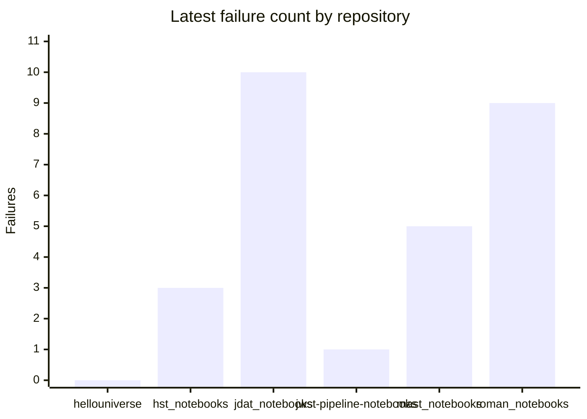
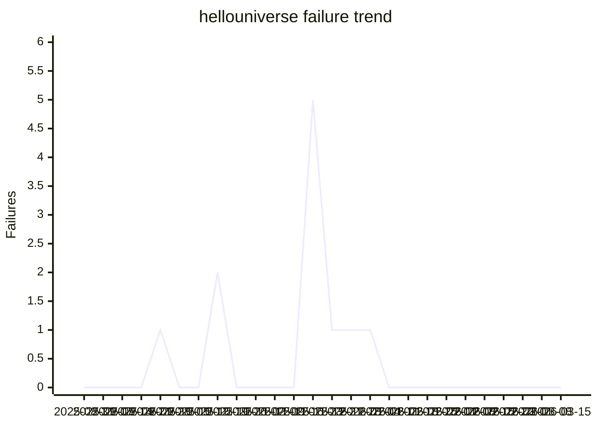
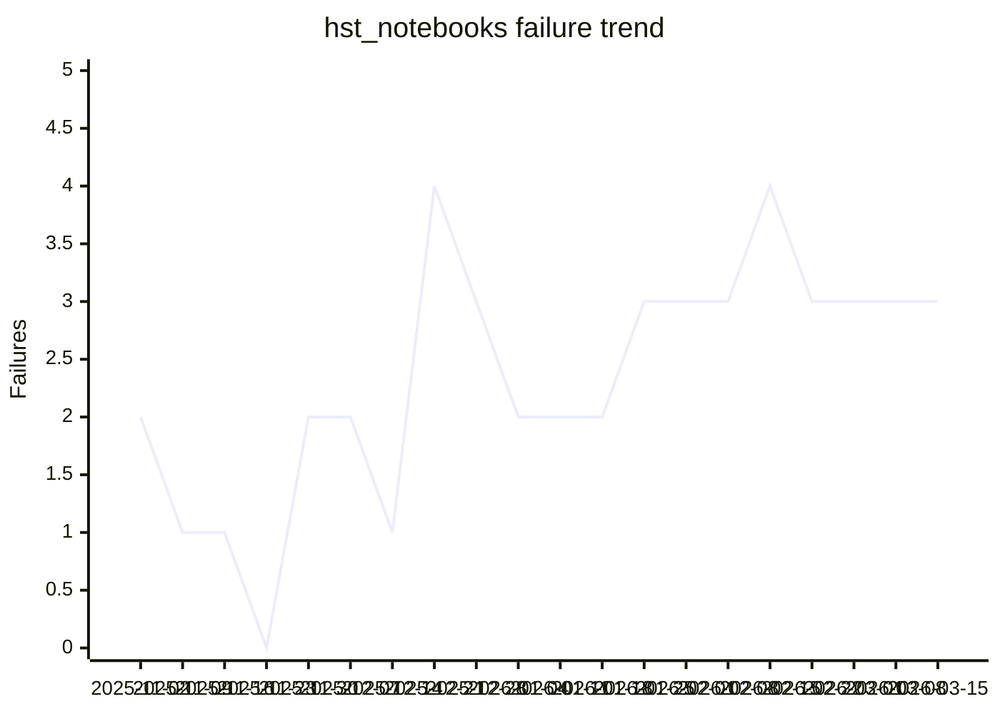
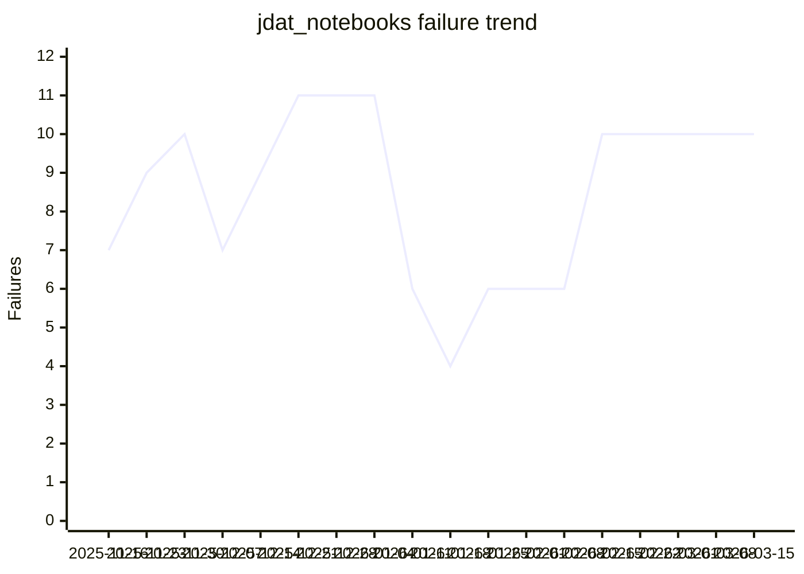
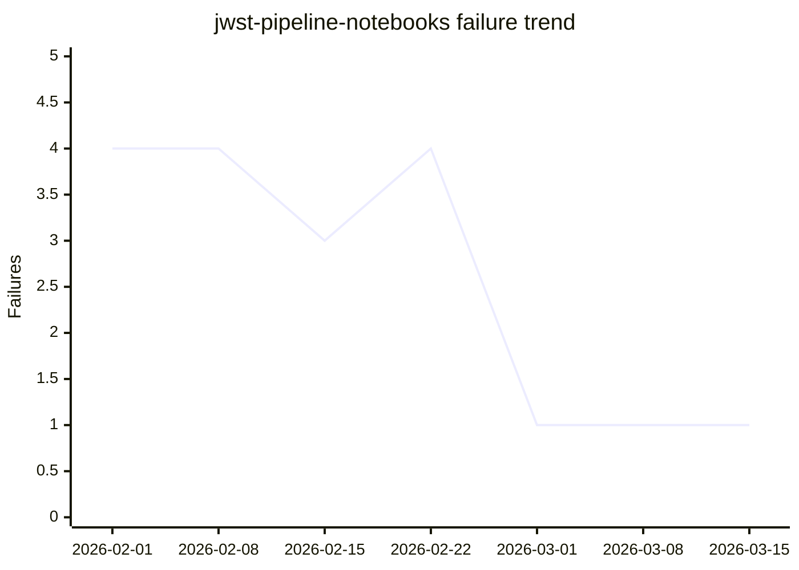
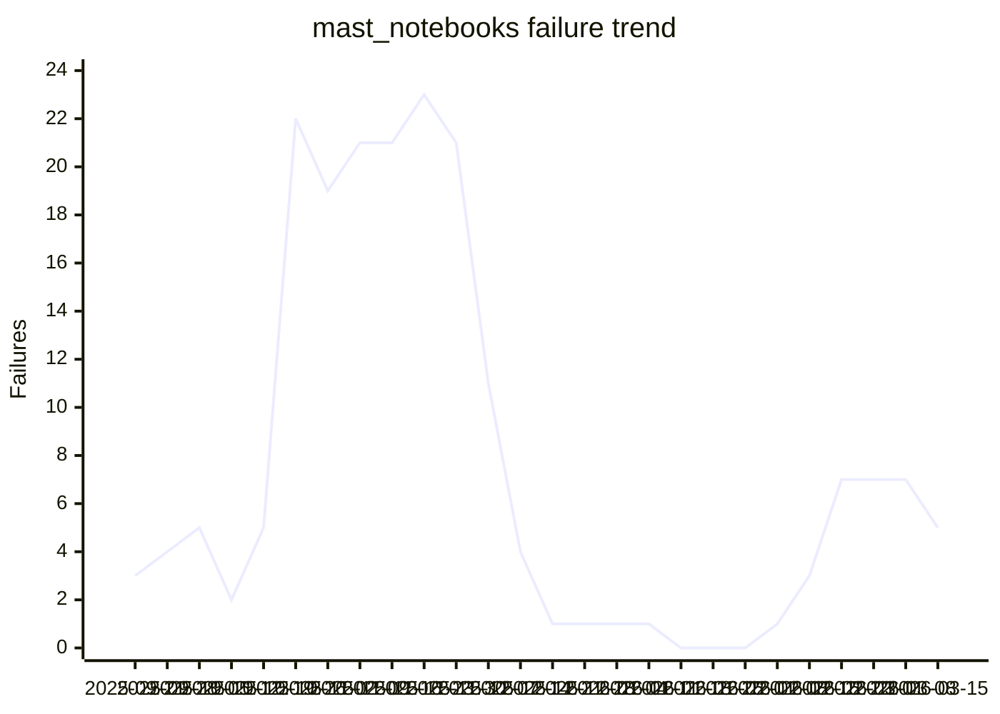
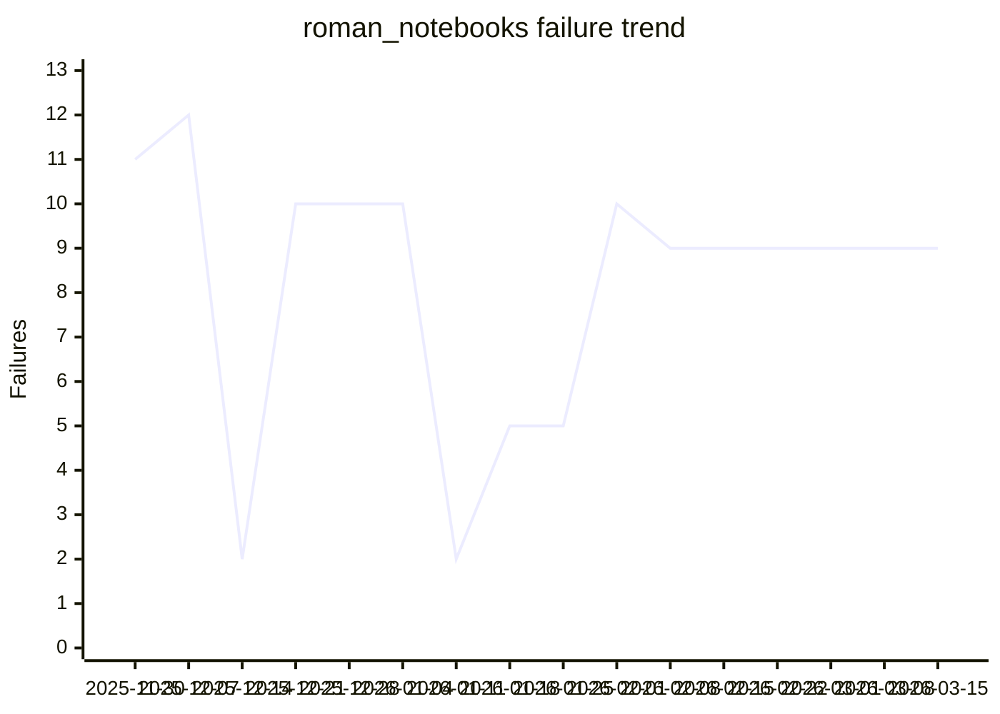

# Notebook CI Dashboard

_Generated 2026-03-19 20:07 UTC_

Workflow tracked: `Notebook CI - Scheduled`

## Executive Summary

| Repository | Latest Failures | New Failures | Resolved | Consistent Failures | Latest Run |
|---|---:|---:|---:|---:|---|
| `spacetelescope/hellouniverse` | 0 | 0 | 0 | 0 | [#30](https://github.com/spacetelescope/hellouniverse/actions/runs/23102195856) |
| `spacetelescope/hst_notebooks` | 3 | 1 | 1 | 2 | [#21](https://github.com/spacetelescope/hst_notebooks/actions/runs/23102221236) |
| `spacetelescope/jdat_notebooks` | 10 | 0 | 0 | 10 | [#19](https://github.com/spacetelescope/jdat_notebooks/actions/runs/23102201298) |
| `spacetelescope/jwst-pipeline-notebooks` | 1 | 0 | 0 | 1 | [#8](https://github.com/spacetelescope/jwst-pipeline-notebooks/actions/runs/23102241381) |
| `spacetelescope/mast_notebooks` | 5 | 0 | 2 | 5 | [#27](https://github.com/spacetelescope/mast_notebooks/actions/runs/23102252114) |
| `spacetelescope/roman_notebooks` | 9 | 0 | 0 | 9 | [#17](https://github.com/spacetelescope/roman_notebooks/actions/runs/23102201256) |

## Latest Failure Count by Repository

## Rolling Trend Table

| Repository | 2025-08-31 | 2025-09-07 | 2025-09-14 | 2025-09-21 | 2025-09-28 | 2025-10-05 | 2025-10-12 | 2025-10-19 | 2025-10-26 | 2025-11-02 | 2025-11-09 | 2025-11-16 | 2025-11-23 | 2025-11-30 | 2025-12-07 | 2025-12-14 | 2025-12-21 | 2025-12-28 | 2026-01-04 | 2026-01-11 | 2026-01-18 | 2026-01-25 | 2026-02-01 | 2026-02-08 | 2026-02-15 | 2026-02-22 | 2026-03-01 | 2026-03-08 | 2026-03-15 |
|---|---:|---:|---:|---:|---:|---:|---:|---:|---:|---:|---:|---:|---:|---:|---:|---:|---:|---:|---:|---:|---:|---:|---:|---:|---:|---:|---:|---:|---:|
| `spacetelescope/hellouniverse` | 0 | 0 | 0 | 0 | 1 | 0 | 0 | 2 | 0 | 0 | 0 | 0 | 5 |  |  |  | 1 | 1 | 1 | 0 | 0 | 0 | 0 | 0 | 0 | 0 | 0 | 0 | 0 |
| `spacetelescope/hst_notebooks` |  |  |  |  |  |  |  |  |  | 2 | 1 | 1 | 0 | 2 | 2 | 1 | 4 | 3 | 2 | 2 | 2 | 3 | 3 | 3 | 4 | 3 | 3 | 3 | 3 |
| `spacetelescope/jdat_notebooks` |  |  |  |  |  |  |  |  |  |  |  | 7 | 9 | 10 | 7 | 9 | 11 | 11 | 11 | 6 | 4 | 6 | 6 | 6 | 10 | 10 | 10 | 10 | 10 |
| `spacetelescope/jwst-pipeline-notebooks` |  |  |  |  |  |  |  |  |  |  |  |  |  |  |  |  |  |  |  |  |  |  | 4 | 4 | 3 | 4 | 1 | 1 | 1 |
| `spacetelescope/mast_notebooks` |  |  |  | 3 | 4 | 5 | 2 | 5 | 22 | 19 | 21 | 21 | 23 | 21 | 11 | 4 | 1 | 1 | 1 | 1 | 0 | 0 | 0 | 1 | 3 | 7 | 7 | 7 | 5 |
| `spacetelescope/roman_notebooks` |  |  |  |  |  |  |  |  |  |  |  |  |  | 11 | 12 | 2 | 10 | 10 | 10 | 2 | 5 | 5 | 10 | 9 | 9 | 9 | 9 | 9 | 9 |

## Per-Repository Trends

### `spacetelescope/hellouniverse`

| Date | Failures | New | Resolved | Consistent | Latest Run |
|---|---:|---:|---:|---:|---|
| 2025-08-31 | 0 | 0 | 0 | 0 | [#5](https://github.com/spacetelescope/hellouniverse/actions/runs/17351502730) |
| 2025-09-07 | 0 | 0 | 0 | 0 | [#6](https://github.com/spacetelescope/hellouniverse/actions/runs/17522718453) |
| 2025-09-14 | 0 | 0 | 0 | 0 | [#7](https://github.com/spacetelescope/hellouniverse/actions/runs/17705267289) |
| 2025-09-21 | 0 | 0 | 0 | 0 | [#8](https://github.com/spacetelescope/hellouniverse/actions/runs/17887892705) |
| 2025-09-28 | 1 | 1 | 0 | 0 | [#9](https://github.com/spacetelescope/hellouniverse/actions/runs/18068165480) |
| 2025-10-05 | 0 | 0 | 1 | 0 | [#10](https://github.com/spacetelescope/hellouniverse/actions/runs/18252779315) |
| 2025-10-12 | 0 | 0 | 0 | 0 | [#11](https://github.com/spacetelescope/hellouniverse/actions/runs/18437986908) |
| 2025-10-19 | 2 | 2 | 0 | 0 | [#12](https://github.com/spacetelescope/hellouniverse/actions/runs/18624271079) |
| 2025-10-26 | 0 | 0 | 2 | 0 | [#13](https://github.com/spacetelescope/hellouniverse/actions/runs/18811808256) |
| 2025-11-02 | 0 | 0 | 0 | 0 | [#14](https://github.com/spacetelescope/hellouniverse/actions/runs/19006177852) |
| 2025-11-09 | 0 | 0 | 0 | 0 | [#15](https://github.com/spacetelescope/hellouniverse/actions/runs/19202166359) |
| 2025-11-16 | 0 | 0 | 0 | 0 | [#16](https://github.com/spacetelescope/hellouniverse/actions/runs/19399158064) |
| 2025-11-23 | 5 | 5 | 0 | 0 | [#17](https://github.com/spacetelescope/hellouniverse/actions/runs/19604771418) |
| 2025-12-21 | 1 | 1 | 5 | 0 | [#18](https://github.com/spacetelescope/hellouniverse/actions/runs/20403586061) |
| 2025-12-28 | 1 | 0 | 0 | 1 | [#19](https://github.com/spacetelescope/hellouniverse/actions/runs/20547798195) |
| 2026-01-04 | 1 | 0 | 0 | 1 | [#20](https://github.com/spacetelescope/hellouniverse/actions/runs/20686579604) |
| 2026-01-11 | 0 | 0 | 1 | 0 | [#21](https://github.com/spacetelescope/hellouniverse/actions/runs/20888369200) |
| 2026-01-18 | 0 | 0 | 0 | 0 | [#22](https://github.com/spacetelescope/hellouniverse/actions/runs/21104850872) |
| 2026-01-25 | 0 | 0 | 0 | 0 | [#23](https://github.com/spacetelescope/hellouniverse/actions/runs/21325789231) |
| 2026-02-01 | 0 | 0 | 0 | 0 | [#24](https://github.com/spacetelescope/hellouniverse/actions/runs/21555578646) |
| 2026-02-08 | 0 | 0 | 0 | 0 | [#25](https://github.com/spacetelescope/hellouniverse/actions/runs/21791320375) |
| 2026-02-15 | 0 | 0 | 0 | 0 | [#26](https://github.com/spacetelescope/hellouniverse/actions/runs/22028738735) |
| 2026-02-22 | 0 | 0 | 0 | 0 | [#27](https://github.com/spacetelescope/hellouniverse/actions/runs/22269359256) |
| 2026-03-01 | 0 | 0 | 0 | 0 | [#28](https://github.com/spacetelescope/hellouniverse/actions/runs/22534735197) |
| 2026-03-08 | 0 | 0 | 0 | 0 | [#29](https://github.com/spacetelescope/hellouniverse/actions/runs/22812661773) |
| 2026-03-15 | 0 | 0 | 0 | 0 | [#30](https://github.com/spacetelescope/hellouniverse/actions/runs/23102195856) |

### `spacetelescope/hst_notebooks`

| Date | Failures | New | Resolved | Consistent | Latest Run |
|---|---:|---:|---:|---:|---|
| 2025-11-02 | 2 | 2 | 1 | 0 | [#2](https://github.com/spacetelescope/hst_notebooks/actions/runs/19006184856) |
| 2025-11-09 | 1 | 0 | 1 | 1 | [#3](https://github.com/spacetelescope/hst_notebooks/actions/runs/19202170182) |
| 2025-11-16 | 1 | 0 | 0 | 1 | [#4](https://github.com/spacetelescope/hst_notebooks/actions/runs/19399160897) |
| 2025-11-23 | 0 | 0 | 1 | 0 | [#5](https://github.com/spacetelescope/hst_notebooks/actions/runs/19604776029) |
| 2025-11-30 | 2 | 2 | 0 | 0 | [#6](https://github.com/spacetelescope/hst_notebooks/actions/runs/19792754283) |
| 2025-12-07 | 2 | 0 | 0 | 2 | [#7](https://github.com/spacetelescope/hst_notebooks/actions/runs/19997861859) |
| 2025-12-14 | 1 | 1 | 2 | 0 | [#8](https://github.com/spacetelescope/hst_notebooks/actions/runs/20201550845) |
| 2025-12-21 | 4 | 3 | 0 | 1 | [#9](https://github.com/spacetelescope/hst_notebooks/actions/runs/20403594916) |
| 2025-12-28 | 3 | 0 | 1 | 3 | [#10](https://github.com/spacetelescope/hst_notebooks/actions/runs/20547809151) |
| 2026-01-04 | 2 | 0 | 1 | 2 | [#11](https://github.com/spacetelescope/hst_notebooks/actions/runs/20686591522) |
| 2026-01-11 | 2 | 0 | 0 | 2 | [#12](https://github.com/spacetelescope/hst_notebooks/actions/runs/20888382187) |
| 2026-01-18 | 2 | 0 | 0 | 2 | [#13](https://github.com/spacetelescope/hst_notebooks/actions/runs/21104868579) |
| 2026-01-25 | 3 | 1 | 0 | 2 | [#14](https://github.com/spacetelescope/hst_notebooks/actions/runs/21325805743) |
| 2026-02-01 | 3 | 1 | 1 | 2 | [#15](https://github.com/spacetelescope/hst_notebooks/actions/runs/21555595960) |
| 2026-02-08 | 3 | 1 | 1 | 2 | [#16](https://github.com/spacetelescope/hst_notebooks/actions/runs/21791337173) |
| 2026-02-15 | 4 | 1 | 0 | 3 | [#17](https://github.com/spacetelescope/hst_notebooks/actions/runs/22028754739) |
| 2026-02-22 | 3 | 0 | 1 | 3 | [#18](https://github.com/spacetelescope/hst_notebooks/actions/runs/22269374253) |
| 2026-03-01 | 3 | 0 | 0 | 3 | [#19](https://github.com/spacetelescope/hst_notebooks/actions/runs/22534757215) |
| 2026-03-08 | 3 | 0 | 0 | 3 | [#20](https://github.com/spacetelescope/hst_notebooks/actions/runs/22812684472) |
| 2026-03-15 | 3 | 1 | 1 | 2 | [#21](https://github.com/spacetelescope/hst_notebooks/actions/runs/23102221236) |

### `spacetelescope/jdat_notebooks`

| Date | Failures | New | Resolved | Consistent | Latest Run |
|---|---:|---:|---:|---:|---|
| 2025-11-16 | 7 | 2 | 1 | 5 | [#2](https://github.com/spacetelescope/jdat_notebooks/actions/runs/19399156352) |
| 2025-11-23 | 9 | 1 | 0 | 7 | [#3](https://github.com/spacetelescope/jdat_notebooks/actions/runs/19604769749) |
| 2025-11-30 | 10 | 2 | 1 | 8 | [#4](https://github.com/spacetelescope/jdat_notebooks/actions/runs/19792748486) |
| 2025-12-07 | 7 | 0 | 3 | 7 | [#5](https://github.com/spacetelescope/jdat_notebooks/actions/runs/19997858945) |
| 2025-12-14 | 9 | 2 | 0 | 7 | [#6](https://github.com/spacetelescope/jdat_notebooks/actions/runs/20201542814) |
| 2025-12-21 | 11 | 2 | 0 | 9 | [#7](https://github.com/spacetelescope/jdat_notebooks/actions/runs/20403589121) |
| 2025-12-28 | 11 | 0 | 0 | 11 | [#8](https://github.com/spacetelescope/jdat_notebooks/actions/runs/20547800332) |
| 2026-01-04 | 11 | 0 | 0 | 11 | [#9](https://github.com/spacetelescope/jdat_notebooks/actions/runs/20686586164) |
| 2026-01-11 | 6 | 0 | 6 | 5 | [#10](https://github.com/spacetelescope/jdat_notebooks/actions/runs/20888370187) |
| 2026-01-18 | 4 | 0 | 2 | 4 | [#11](https://github.com/spacetelescope/jdat_notebooks/actions/runs/21104853045) |
| 2026-01-25 | 6 | 2 | 0 | 4 | [#12](https://github.com/spacetelescope/jdat_notebooks/actions/runs/21325797922) |
| 2026-02-01 | 6 | 0 | 0 | 6 | [#13](https://github.com/spacetelescope/jdat_notebooks/actions/runs/21555582858) |
| 2026-02-08 | 6 | 0 | 0 | 6 | [#14](https://github.com/spacetelescope/jdat_notebooks/actions/runs/21791331535) |
| 2026-02-15 | 10 | 4 | 0 | 6 | [#15](https://github.com/spacetelescope/jdat_notebooks/actions/runs/22028744351) |
| 2026-02-22 | 10 | 0 | 0 | 10 | [#16](https://github.com/spacetelescope/jdat_notebooks/actions/runs/22269366250) |
| 2026-03-01 | 10 | 0 | 0 | 10 | [#17](https://github.com/spacetelescope/jdat_notebooks/actions/runs/22534742425) |
| 2026-03-08 | 10 | 0 | 0 | 10 | [#18](https://github.com/spacetelescope/jdat_notebooks/actions/runs/22812671444) |
| 2026-03-15 | 10 | 0 | 0 | 10 | [#19](https://github.com/spacetelescope/jdat_notebooks/actions/runs/23102201298) |

### `spacetelescope/jwst-pipeline-notebooks`

| Date | Failures | New | Resolved | Consistent | Latest Run |
|---|---:|---:|---:|---:|---|
| 2026-02-01 | 4 | 3 | 0 | 1 | [#2](https://github.com/spacetelescope/jwst-pipeline-notebooks/actions/runs/21555614673) |
| 2026-02-08 | 4 | 0 | 0 | 4 | [#3](https://github.com/spacetelescope/jwst-pipeline-notebooks/actions/runs/21791358472) |
| 2026-02-15 | 3 | 0 | 0 | 3 | [#4](https://github.com/spacetelescope/jwst-pipeline-notebooks/actions/runs/22028769539) |
| 2026-02-22 | 4 | 0 | 0 | 3 | [#5](https://github.com/spacetelescope/jwst-pipeline-notebooks/actions/runs/22269392614) |
| 2026-03-01 | 1 | 0 | 3 | 1 | [#6](https://github.com/spacetelescope/jwst-pipeline-notebooks/actions/runs/22534778443) |
| 2026-03-08 | 1 | 0 | 0 | 1 | [#7](https://github.com/spacetelescope/jwst-pipeline-notebooks/actions/runs/22812701959) |
| 2026-03-15 | 1 | 0 | 0 | 1 | [#8](https://github.com/spacetelescope/jwst-pipeline-notebooks/actions/runs/23102241381) |

### `spacetelescope/mast_notebooks`

| Date | Failures | New | Resolved | Consistent | Latest Run |
|---|---:|---:|---:|---:|---|
| 2025-09-21 | 3 | 3 | 0 | 0 | [#2](https://github.com/spacetelescope/mast_notebooks/actions/runs/17887907291) |
| 2025-09-28 | 4 | 2 | 1 | 2 | [#3](https://github.com/spacetelescope/mast_notebooks/actions/runs/18068180323) |
| 2025-10-05 | 5 | 3 | 2 | 2 | [#4](https://github.com/spacetelescope/mast_notebooks/actions/runs/18252792930) |
| 2025-10-12 | 2 | 0 | 3 | 2 | [#5](https://github.com/spacetelescope/mast_notebooks/actions/runs/18438001630) |
| 2025-10-19 | 5 | 3 | 0 | 2 | [#6](https://github.com/spacetelescope/mast_notebooks/actions/runs/18624285788) |
| 2025-10-26 | 22 | 19 | 2 | 3 | [#7](https://github.com/spacetelescope/mast_notebooks/actions/runs/18811822978) |
| 2025-11-02 | 19 | 0 | 3 | 19 | [#8](https://github.com/spacetelescope/mast_notebooks/actions/runs/19006193903) |
| 2025-11-09 | 21 | 2 | 0 | 19 | [#9](https://github.com/spacetelescope/mast_notebooks/actions/runs/19202183449) |
| 2025-11-16 | 21 | 0 | 0 | 21 | [#10](https://github.com/spacetelescope/mast_notebooks/actions/runs/19399173903) |
| 2025-11-23 | 23 | 2 | 0 | 21 | [#11](https://github.com/spacetelescope/mast_notebooks/actions/runs/19604790963) |
| 2025-11-30 | 21 | 0 | 2 | 21 | [#12](https://github.com/spacetelescope/mast_notebooks/actions/runs/19792768129) |
| 2025-12-07 | 11 | 1 | 0 | 10 | [#13](https://github.com/spacetelescope/mast_notebooks/actions/runs/19997878259) |
| 2025-12-14 | 4 | 0 | 10 | 1 | [#14](https://github.com/spacetelescope/mast_notebooks/actions/runs/20201566459) |
| 2025-12-21 | 1 | 1 | 4 | 0 | [#15](https://github.com/spacetelescope/mast_notebooks/actions/runs/20403612854) |
| 2025-12-28 | 1 | 0 | 0 | 1 | [#16](https://github.com/spacetelescope/mast_notebooks/actions/runs/20547824976) |
| 2026-01-04 | 1 | 0 | 0 | 1 | [#17](https://github.com/spacetelescope/mast_notebooks/actions/runs/20686607162) |
| 2026-01-11 | 1 | 0 | 0 | 1 | [#18](https://github.com/spacetelescope/mast_notebooks/actions/runs/20888397774) |
| 2026-01-18 | 0 | 0 | 1 | 0 | [#19](https://github.com/spacetelescope/mast_notebooks/actions/runs/21104895468) |
| 2026-01-25 | 0 | 0 | 0 | 0 | [#20](https://github.com/spacetelescope/mast_notebooks/actions/runs/21325823614) |
| 2026-02-01 | 0 | 0 | 0 | 0 | [#21](https://github.com/spacetelescope/mast_notebooks/actions/runs/21555622326) |
| 2026-02-08 | 1 | 1 | 0 | 0 | [#22](https://github.com/spacetelescope/mast_notebooks/actions/runs/21791362891) |
| 2026-02-15 | 3 | 3 | 1 | 0 | [#23](https://github.com/spacetelescope/mast_notebooks/actions/runs/22028778954) |
| 2026-02-22 | 7 | 4 | 0 | 3 | [#24](https://github.com/spacetelescope/mast_notebooks/actions/runs/22269399051) |
| 2026-03-01 | 7 | 1 | 1 | 6 | [#25](https://github.com/spacetelescope/mast_notebooks/actions/runs/22534789491) |
| 2026-03-08 | 7 | 0 | 0 | 7 | [#26](https://github.com/spacetelescope/mast_notebooks/actions/runs/22812714353) |
| 2026-03-15 | 5 | 0 | 2 | 5 | [#27](https://github.com/spacetelescope/mast_notebooks/actions/runs/23102252114) |

### `spacetelescope/roman_notebooks`

| Date | Failures | New | Resolved | Consistent | Latest Run |
|---|---:|---:|---:|---:|---|
| 2025-11-30 | 11 | 0 | 0 | 11 | [#2](https://github.com/spacetelescope/roman_notebooks/actions/runs/19792747595) |
| 2025-12-07 | 12 | 0 | 0 | 11 | [#3](https://github.com/spacetelescope/roman_notebooks/actions/runs/19997858105) |
| 2025-12-14 | 2 | 0 | 10 | 2 | [#4](https://github.com/spacetelescope/roman_notebooks/actions/runs/20201542584) |
| 2025-12-21 | 10 | 8 | 0 | 2 | [#5](https://github.com/spacetelescope/roman_notebooks/actions/runs/20403589018) |
| 2025-12-28 | 10 | 0 | 0 | 10 | [#6](https://github.com/spacetelescope/roman_notebooks/actions/runs/20547799322) |
| 2026-01-04 | 10 | 0 | 0 | 10 | [#7](https://github.com/spacetelescope/roman_notebooks/actions/runs/20686585636) |
| 2026-01-11 | 2 | 0 | 8 | 2 | [#8](https://github.com/spacetelescope/roman_notebooks/actions/runs/20888369628) |
| 2026-01-18 | 5 | 3 | 0 | 2 | [#9](https://github.com/spacetelescope/roman_notebooks/actions/runs/21104852416) |
| 2026-01-25 | 5 | 0 | 0 | 5 | [#10](https://github.com/spacetelescope/roman_notebooks/actions/runs/21325797813) |
| 2026-02-01 | 10 | 5 | 0 | 5 | [#11](https://github.com/spacetelescope/roman_notebooks/actions/runs/21555583648) |
| 2026-02-08 | 9 | 0 | 1 | 9 | [#12](https://github.com/spacetelescope/roman_notebooks/actions/runs/21791330623) |
| 2026-02-15 | 9 | 0 | 0 | 9 | [#13](https://github.com/spacetelescope/roman_notebooks/actions/runs/22028744071) |
| 2026-02-22 | 9 | 0 | 0 | 9 | [#14](https://github.com/spacetelescope/roman_notebooks/actions/runs/22269362405) |
| 2026-03-01 | 9 | 0 | 0 | 9 | [#15](https://github.com/spacetelescope/roman_notebooks/actions/runs/22534740263) |
| 2026-03-08 | 9 | 0 | 0 | 9 | [#16](https://github.com/spacetelescope/roman_notebooks/actions/runs/22812668184) |
| 2026-03-15 | 9 | 0 | 0 | 9 | [#17](https://github.com/spacetelescope/roman_notebooks/actions/runs/23102201256) |
