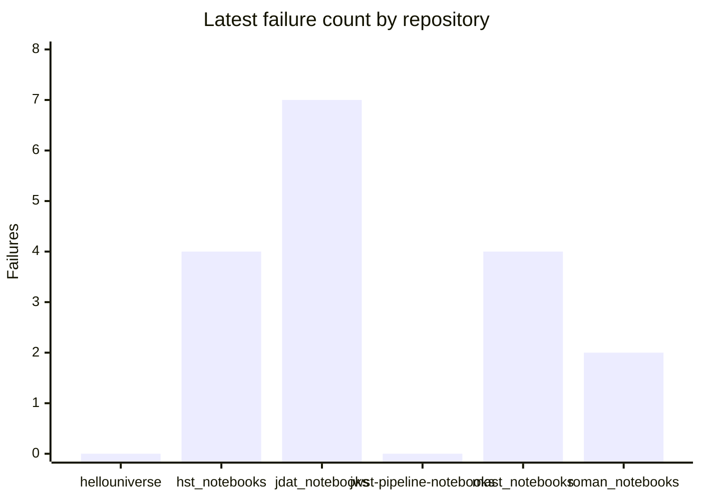
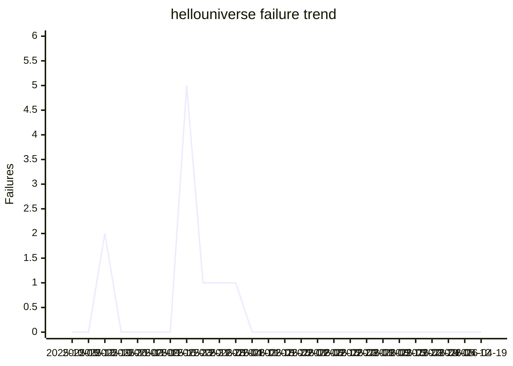
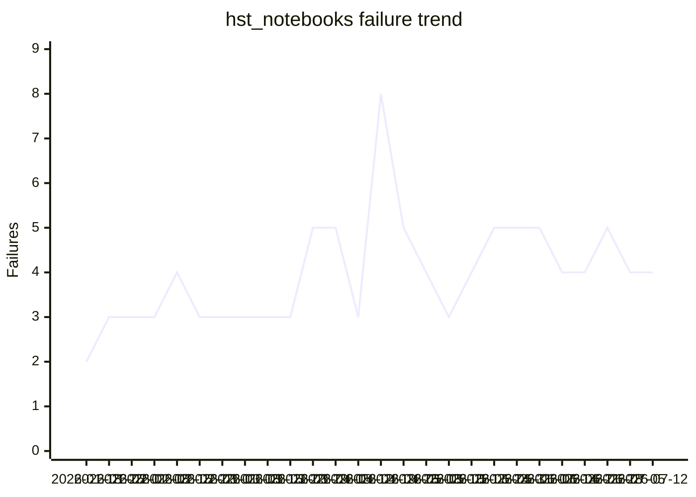
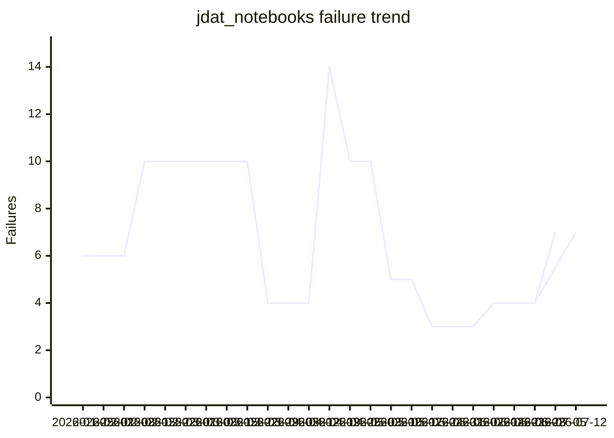
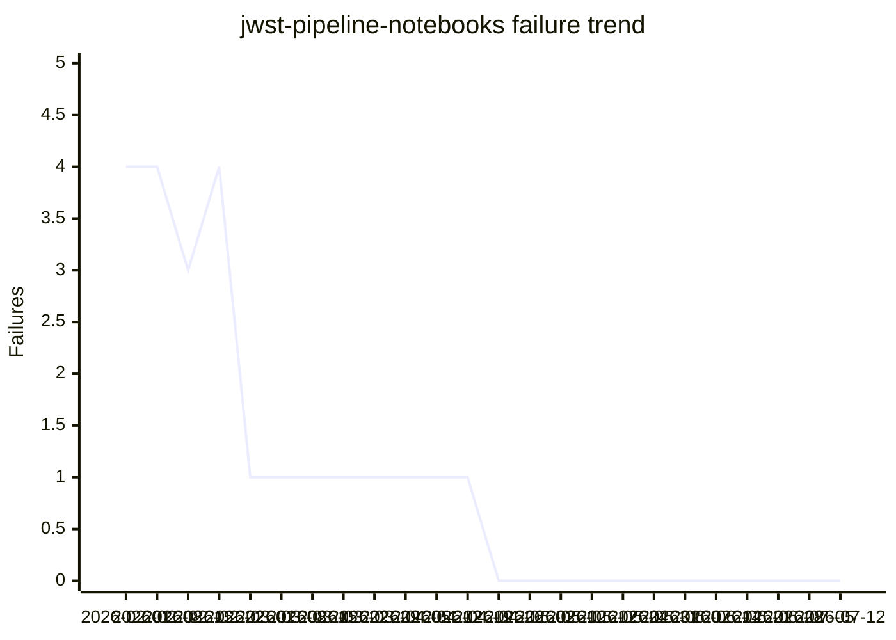
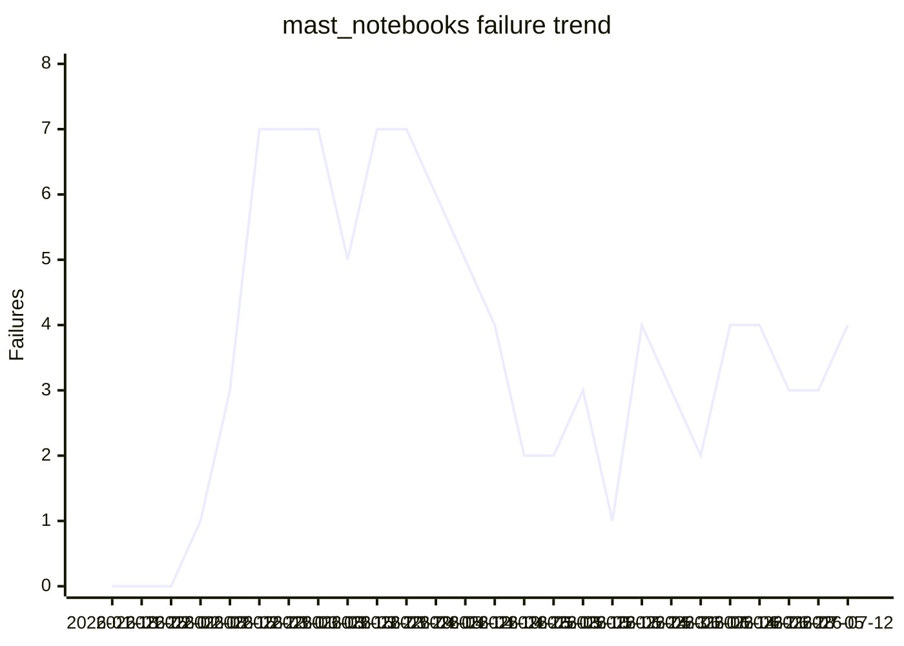
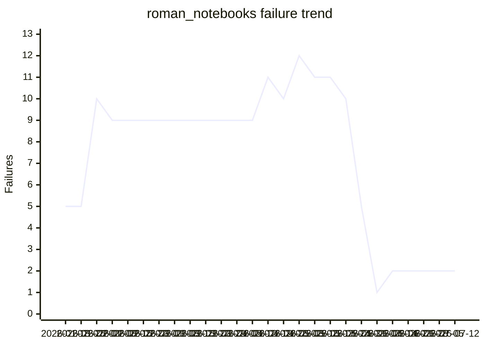

# Notebook CI Dashboard

_Generated 2026-07-13 15:28 UTC_

Workflow tracked: `Notebook CI - Scheduled`

## Executive Summary

| Repository | Latest Failures | New Failures | Resolved | Consistent Failures | Latest Run |
|---|---:|---:|---:|---:|---|
| `spacetelescope/hellouniverse` | 0 | 0 | 0 | 0 | [#35](https://github.com/spacetelescope/hellouniverse/actions/runs/24619741210) |
| `spacetelescope/hst_notebooks` | 4 | 0 | 0 | 4 | [#38](https://github.com/spacetelescope/hst_notebooks/actions/runs/29177842499) |
| `spacetelescope/jdat_notebooks` | 7 | 0 | 0 | 7 | [#36](https://github.com/spacetelescope/jdat_notebooks/actions/runs/29177817203) |
| `spacetelescope/jwst-pipeline-notebooks` | 0 | 0 | 0 | 0 | [#25](https://github.com/spacetelescope/jwst-pipeline-notebooks/actions/runs/29177865406) |
| `spacetelescope/mast_notebooks` | 4 | 1 | 0 | 3 | [#44](https://github.com/spacetelescope/mast_notebooks/actions/runs/29177889743) |
| `spacetelescope/roman_notebooks` | 2 | 0 | 0 | 2 | [#34](https://github.com/spacetelescope/roman_notebooks/actions/runs/29177816450) |

## Latest Failure Count by Repository

```mermaid
xychart-beta
    title "Latest failure count by repository"
    x-axis ["hellouniverse", "hst_notebooks", "jdat_notebooks", "jwst-pipeline-notebooks", "mast_notebooks", "roman_notebooks"]
    y-axis "Failures" 0 --> 8
    bar [0, 4, 7, 0, 4, 2]
```

## Rolling Trend Table

| Repository | 2025-10-05 | 2025-10-12 | 2025-10-19 | 2025-10-26 | 2025-11-02 | 2025-11-09 | 2025-11-16 | 2025-11-23 | 2025-12-21 | 2025-12-28 | 2026-01-04 | 2026-01-11 | 2026-01-18 | 2026-01-25 | 2026-02-01 | 2026-02-08 | 2026-02-15 | 2026-02-22 | 2026-03-01 | 2026-03-08 | 2026-03-15 | 2026-03-22 | 2026-03-29 | 2026-04-05 | 2026-04-12 | 2026-04-19 | 2026-04-26 | 2026-05-03 | 2026-05-10 | 2026-05-17 | 2026-05-24 | 2026-05-31 | 2026-06-07 | 2026-06-14 | 2026-06-21 | 2026-06-28 | 2026-07-05 | 2026-07-12 |
|---|---:|---:|---:|---:|---:|---:|---:|---:|---:|---:|---:|---:|---:|---:|---:|---:|---:|---:|---:|---:|---:|---:|---:|---:|---:|---:|---:|---:|---:|---:|---:|---:|---:|---:|---:|---:|---:|---:|
| `spacetelescope/hellouniverse` | 0 | 0 | 2 | 0 | 0 | 0 | 0 | 5 | 1 | 1 | 1 | 0 | 0 | 0 | 0 | 0 | 0 | 0 | 0 | 0 | 0 | 0 | 0 | 0 | 0 | 0 |  |  |  |  |  |  |  |  |  |  |  |  |
| `spacetelescope/hst_notebooks` |  |  |  |  |  |  |  |  |  |  |  |  | 2 | 3 | 3 | 3 | 4 | 3 | 3 | 3 | 3 | 3 | 5 | 5 | 3 | 8 | 5 | 4 | 3 | 4 | 5 | 5 | 5 | 4 | 4 | 5 | 4 | 4 |
| `spacetelescope/jdat_notebooks` |  |  |  |  |  |  |  |  |  |  |  |  |  | 6 | 6 | 6 | 10 | 10 | 10 | 10 | 10 | 10 | 4 | 4 | 4 | 14 | 10 | 10 | 5 | 5 | 3 | 3 | 3 | 4 | 4 | 4 | 7 | 7 |
| `spacetelescope/jwst-pipeline-notebooks` |  |  |  |  |  |  |  |  |  |  |  |  |  |  | 4 | 4 | 3 | 4 | 1 | 1 | 1 | 1 | 1 | 1 | 1 | 1 | 0 | 0 | 0 | 0 | 0 | 0 | 0 | 0 | 0 | 0 | 0 | 0 |
| `spacetelescope/mast_notebooks` |  |  |  |  |  |  |  |  |  |  |  |  | 0 | 0 | 0 | 1 | 3 | 7 | 7 | 7 | 5 | 7 | 7 | 6 | 5 | 4 | 2 | 2 | 3 | 1 | 4 | 3 | 2 | 4 | 4 | 3 | 3 | 4 |
| `spacetelescope/roman_notebooks` |  |  |  |  |  |  |  |  |  |  |  |  | 5 | 5 | 10 | 9 | 9 | 9 | 9 | 9 | 9 | 9 | 9 | 9 | 9 | 11 | 10 | 12 | 11 | 11 | 10 | 5 | 1 | 2 | 2 | 2 | 2 | 2 |

## Per-Repository Trends

### `spacetelescope/hellouniverse`

```mermaid
xychart-beta
    title "hellouniverse failure trend"
    x-axis ["2025-10-05", "2025-10-12", "2025-10-19", "2025-10-26", "2025-11-02", "2025-11-09", "2025-11-16", "2025-11-23", "2025-12-21", "2025-12-28", "2026-01-04", "2026-01-11", "2026-01-18", "2026-01-25", "2026-02-01", "2026-02-08", "2026-02-15", "2026-02-22", "2026-03-01", "2026-03-08", "2026-03-15", "2026-03-22", "2026-03-29", "2026-04-05", "2026-04-12", "2026-04-19"]
    y-axis "Failures" 0 --> 6
    line [0, 0, 2, 0, 0, 0, 0, 5, 1, 1, 1, 0, 0, 0, 0, 0, 0, 0, 0, 0, 0, 0, 0, 0, 0, 0]
```

| Date | Failures | New | Resolved | Consistent | Latest Run |
|---|---:|---:|---:|---:|---|
| 2025-10-05 | 0 | 0 | 1 | 0 | [#10](https://github.com/spacetelescope/hellouniverse/actions/runs/18252779315) |
| 2025-10-12 | 0 | 0 | 0 | 0 | [#11](https://github.com/spacetelescope/hellouniverse/actions/runs/18437986908) |
| 2025-10-19 | 2 | 2 | 0 | 0 | [#12](https://github.com/spacetelescope/hellouniverse/actions/runs/18624271079) |
| 2025-10-26 | 0 | 0 | 2 | 0 | [#13](https://github.com/spacetelescope/hellouniverse/actions/runs/18811808256) |
| 2025-11-02 | 0 | 0 | 0 | 0 | [#14](https://github.com/spacetelescope/hellouniverse/actions/runs/19006177852) |
| 2025-11-09 | 0 | 0 | 0 | 0 | [#15](https://github.com/spacetelescope/hellouniverse/actions/runs/19202166359) |
| 2025-11-16 | 0 | 0 | 0 | 0 | [#16](https://github.com/spacetelescope/hellouniverse/actions/runs/19399158064) |
| 2025-11-23 | 5 | 5 | 0 | 0 | [#17](https://github.com/spacetelescope/hellouniverse/actions/runs/19604771418) |
| 2025-12-21 | 1 | 1 | 5 | 0 | [#18](https://github.com/spacetelescope/hellouniverse/actions/runs/20403586061) |
| 2025-12-28 | 1 | 0 | 0 | 1 | [#19](https://github.com/spacetelescope/hellouniverse/actions/runs/20547798195) |
| 2026-01-04 | 1 | 0 | 0 | 1 | [#20](https://github.com/spacetelescope/hellouniverse/actions/runs/20686579604) |
| 2026-01-11 | 0 | 0 | 1 | 0 | [#21](https://github.com/spacetelescope/hellouniverse/actions/runs/20888369200) |
| 2026-01-18 | 0 | 0 | 0 | 0 | [#22](https://github.com/spacetelescope/hellouniverse/actions/runs/21104850872) |
| 2026-01-25 | 0 | 0 | 0 | 0 | [#23](https://github.com/spacetelescope/hellouniverse/actions/runs/21325789231) |
| 2026-02-01 | 0 | 0 | 0 | 0 | [#24](https://github.com/spacetelescope/hellouniverse/actions/runs/21555578646) |
| 2026-02-08 | 0 | 0 | 0 | 0 | [#25](https://github.com/spacetelescope/hellouniverse/actions/runs/21791320375) |
| 2026-02-15 | 0 | 0 | 0 | 0 | [#26](https://github.com/spacetelescope/hellouniverse/actions/runs/22028738735) |
| 2026-02-22 | 0 | 0 | 0 | 0 | [#27](https://github.com/spacetelescope/hellouniverse/actions/runs/22269359256) |
| 2026-03-01 | 0 | 0 | 0 | 0 | [#28](https://github.com/spacetelescope/hellouniverse/actions/runs/22534735197) |
| 2026-03-08 | 0 | 0 | 0 | 0 | [#29](https://github.com/spacetelescope/hellouniverse/actions/runs/22812661773) |
| 2026-03-15 | 0 | 0 | 0 | 0 | [#30](https://github.com/spacetelescope/hellouniverse/actions/runs/23102195856) |
| 2026-03-22 | 0 | 0 | 0 | 0 | [#31](https://github.com/spacetelescope/hellouniverse/actions/runs/23394523547) |
| 2026-03-29 | 0 | 0 | 0 | 0 | [#32](https://github.com/spacetelescope/hellouniverse/actions/runs/23700180710) |
| 2026-04-05 | 0 | 0 | 0 | 0 | [#33](https://github.com/spacetelescope/hellouniverse/actions/runs/23993128483) |
| 2026-04-12 | 0 | 0 | 0 | 0 | [#34](https://github.com/spacetelescope/hellouniverse/actions/runs/24297475556) |
| 2026-04-19 | 0 | 0 | 0 | 0 | [#35](https://github.com/spacetelescope/hellouniverse/actions/runs/24619741210) |

### `spacetelescope/hst_notebooks`

```mermaid
xychart-beta
    title "hst_notebooks failure trend"
    x-axis ["2026-01-18", "2026-01-25", "2026-02-01", "2026-02-08", "2026-02-15", "2026-02-22", "2026-03-01", "2026-03-08", "2026-03-15", "2026-03-22", "2026-03-29", "2026-04-05", "2026-04-12", "2026-04-19", "2026-04-26", "2026-05-03", "2026-05-10", "2026-05-17", "2026-05-24", "2026-05-31", "2026-06-07", "2026-06-14", "2026-06-21", "2026-06-28", "2026-07-05", "2026-07-12"]
    y-axis "Failures" 0 --> 9
    line [2, 3, 3, 3, 4, 3, 3, 3, 3, 3, 5, 5, 3, 8, 5, 4, 3, 4, 5, 5, 5, 4, 4, 5, 4, 4]
```

| Date | Failures | New | Resolved | Consistent | Latest Run |
|---|---:|---:|---:|---:|---|
| 2026-01-18 | 2 | 0 | 0 | 2 | [#13](https://github.com/spacetelescope/hst_notebooks/actions/runs/21104868579) |
| 2026-01-25 | 3 | 1 | 0 | 2 | [#14](https://github.com/spacetelescope/hst_notebooks/actions/runs/21325805743) |
| 2026-02-01 | 3 | 1 | 1 | 2 | [#15](https://github.com/spacetelescope/hst_notebooks/actions/runs/21555595960) |
| 2026-02-08 | 3 | 1 | 1 | 2 | [#16](https://github.com/spacetelescope/hst_notebooks/actions/runs/21791337173) |
| 2026-02-15 | 4 | 1 | 0 | 3 | [#17](https://github.com/spacetelescope/hst_notebooks/actions/runs/22028754739) |
| 2026-02-22 | 3 | 0 | 1 | 3 | [#18](https://github.com/spacetelescope/hst_notebooks/actions/runs/22269374253) |
| 2026-03-01 | 3 | 0 | 0 | 3 | [#19](https://github.com/spacetelescope/hst_notebooks/actions/runs/22534757215) |
| 2026-03-08 | 3 | 0 | 0 | 3 | [#20](https://github.com/spacetelescope/hst_notebooks/actions/runs/22812684472) |
| 2026-03-15 | 3 | 1 | 1 | 2 | [#21](https://github.com/spacetelescope/hst_notebooks/actions/runs/23102221236) |
| 2026-03-22 | 3 | 1 | 1 | 2 | [#22](https://github.com/spacetelescope/hst_notebooks/actions/runs/23394546172) |
| 2026-03-29 | 5 | 2 | 0 | 3 | [#23](https://github.com/spacetelescope/hst_notebooks/actions/runs/23700208471) |
| 2026-04-05 | 5 | 1 | 1 | 4 | [#24](https://github.com/spacetelescope/hst_notebooks/actions/runs/23993153155) |
| 2026-04-12 | 3 | 1 | 3 | 2 | [#25](https://github.com/spacetelescope/hst_notebooks/actions/runs/24297506864) |
| 2026-04-19 | 8 | 5 | 0 | 3 | [#26](https://github.com/spacetelescope/hst_notebooks/actions/runs/24619769326) |
| 2026-04-26 | 5 | 0 | 3 | 5 | [#27](https://github.com/spacetelescope/hst_notebooks/actions/runs/24947031028) |
| 2026-05-03 | 4 | 1 | 2 | 3 | [#28](https://github.com/spacetelescope/hst_notebooks/actions/runs/25268551613) |
| 2026-05-10 | 3 | 0 | 1 | 3 | [#29](https://github.com/spacetelescope/hst_notebooks/actions/runs/25618503170) |
| 2026-05-17 | 4 | 1 | 0 | 3 | [#30](https://github.com/spacetelescope/hst_notebooks/actions/runs/25980016873) |
| 2026-05-24 | 5 | 2 | 1 | 3 | [#31](https://github.com/spacetelescope/hst_notebooks/actions/runs/26350581922) |
| 2026-05-31 | 5 | 0 | 0 | 5 | [#32](https://github.com/spacetelescope/hst_notebooks/actions/runs/26701967578) |
| 2026-06-07 | 5 | 1 | 1 | 4 | [#33](https://github.com/spacetelescope/hst_notebooks/actions/runs/27081333893) |
| 2026-06-14 | 4 | 0 | 1 | 4 | [#34](https://github.com/spacetelescope/hst_notebooks/actions/runs/27486943195) |
| 2026-06-21 | 4 | 1 | 1 | 3 | [#35](https://github.com/spacetelescope/hst_notebooks/actions/runs/27892030218) |
| 2026-06-28 | 5 | 1 | 0 | 4 | [#36](https://github.com/spacetelescope/hst_notebooks/actions/runs/28309845173) |
| 2026-07-05 | 4 | 1 | 1 | 3 | [#37](https://github.com/spacetelescope/hst_notebooks/actions/runs/28727903281) |
| 2026-07-12 | 4 | 0 | 0 | 4 | [#38](https://github.com/spacetelescope/hst_notebooks/actions/runs/29177842499) |

### `spacetelescope/jdat_notebooks`

```mermaid
xychart-beta
    title "jdat_notebooks failure trend"
    x-axis ["2026-01-25", "2026-02-01", "2026-02-08", "2026-02-15", "2026-02-22", "2026-03-01", "2026-03-08", "2026-03-15", "2026-03-22", "2026-03-29", "2026-04-05", "2026-04-12", "2026-04-19", "2026-04-26", "2026-05-03", "2026-05-10", "2026-05-17", "2026-05-24", "2026-05-31", "2026-06-07", "2026-06-14", "2026-06-21", "2026-06-28", "2026-07-05", "2026-06-28", "2026-07-12"]
    y-axis "Failures" 0 --> 15
    line [6, 6, 6, 10, 10, 10, 10, 10, 10, 4, 4, 4, 14, 10, 10, 5, 5, 3, 3, 3, 4, 4, 4, 7, 4, 7]
```

| Date | Failures | New | Resolved | Consistent | Latest Run |
|---|---:|---:|---:|---:|---|
| 2026-01-25 | 6 | 2 | 0 | 4 | [#12](https://github.com/spacetelescope/jdat_notebooks/actions/runs/21325797922) |
| 2026-02-01 | 6 | 0 | 0 | 6 | [#13](https://github.com/spacetelescope/jdat_notebooks/actions/runs/21555582858) |
| 2026-02-08 | 6 | 0 | 0 | 6 | [#14](https://github.com/spacetelescope/jdat_notebooks/actions/runs/21791331535) |
| 2026-02-15 | 10 | 4 | 0 | 6 | [#15](https://github.com/spacetelescope/jdat_notebooks/actions/runs/22028744351) |
| 2026-02-22 | 10 | 0 | 0 | 10 | [#16](https://github.com/spacetelescope/jdat_notebooks/actions/runs/22269366250) |
| 2026-03-01 | 10 | 0 | 0 | 10 | [#17](https://github.com/spacetelescope/jdat_notebooks/actions/runs/22534742425) |
| 2026-03-08 | 10 | 0 | 0 | 10 | [#18](https://github.com/spacetelescope/jdat_notebooks/actions/runs/22812671444) |
| 2026-03-15 | 10 | 0 | 0 | 10 | [#19](https://github.com/spacetelescope/jdat_notebooks/actions/runs/23102201298) |
| 2026-03-22 | 10 | 0 | 0 | 10 | [#20](https://github.com/spacetelescope/jdat_notebooks/actions/runs/23394525556) |
| 2026-03-29 | 4 | 0 | 6 | 4 | [#21](https://github.com/spacetelescope/jdat_notebooks/actions/runs/23700192899) |
| 2026-04-05 | 4 | 0 | 0 | 4 | [#22](https://github.com/spacetelescope/jdat_notebooks/actions/runs/23993134367) |
| 2026-04-12 | 4 | 0 | 0 | 4 | [#23](https://github.com/spacetelescope/jdat_notebooks/actions/runs/24297485381) |
| 2026-04-19 | 14 | 13 | 3 | 1 | [#24](https://github.com/spacetelescope/jdat_notebooks/actions/runs/24619752904) |
| 2026-04-26 | 10 | 0 | 4 | 10 | [#25](https://github.com/spacetelescope/jdat_notebooks/actions/runs/24947007563) |
| 2026-05-03 | 10 | 0 | 0 | 10 | [#26](https://github.com/spacetelescope/jdat_notebooks/actions/runs/25268527429) |
| 2026-05-10 | 5 | 0 | 0 | 0 | [#27](https://github.com/spacetelescope/jdat_notebooks/actions/runs/25618482201) |
| 2026-05-17 | 5 | 0 | 0 | 5 | [#28](https://github.com/spacetelescope/jdat_notebooks/actions/runs/25979988260) |
| 2026-05-24 | 3 | 0 | 2 | 3 | [#29](https://github.com/spacetelescope/jdat_notebooks/actions/runs/26350564318) |
| 2026-05-31 | 3 | 0 | 0 | 3 | [#30](https://github.com/spacetelescope/jdat_notebooks/actions/runs/26701941982) |
| 2026-06-07 | 3 | 0 | 0 | 3 | [#31](https://github.com/spacetelescope/jdat_notebooks/actions/runs/27081311775) |
| 2026-06-14 | 4 | 1 | 0 | 3 | [#32](https://github.com/spacetelescope/jdat_notebooks/actions/runs/27486919946) |
| 2026-06-21 | 4 | 0 | 0 | 4 | [#33](https://github.com/spacetelescope/jdat_notebooks/actions/runs/27892006796) |
| 2026-06-28 | 4 | 0 | 0 | 4 | [#34](https://github.com/spacetelescope/jdat_notebooks/actions/runs/28309818810) |
| 2026-07-05 | 7 | 3 | 0 | 4 | [#35](https://github.com/spacetelescope/jdat_notebooks/actions/runs/28727879256) |
| 2026-06-28 | 4 | 0 | 0 | 4 | [#34](https://github.com/spacetelescope/jdat_notebooks/actions/runs/28309818810) |
| 2026-07-12 | 7 | 0 | 0 | 7 | [#36](https://github.com/spacetelescope/jdat_notebooks/actions/runs/29177817203) |

### `spacetelescope/jwst-pipeline-notebooks`

```mermaid
xychart-beta
    title "jwst-pipeline-notebooks failure trend"
    x-axis ["2026-02-01", "2026-02-08", "2026-02-15", "2026-02-22", "2026-03-01", "2026-03-08", "2026-03-15", "2026-03-22", "2026-03-29", "2026-04-05", "2026-04-12", "2026-04-19", "2026-04-26", "2026-05-03", "2026-05-10", "2026-05-17", "2026-05-24", "2026-05-31", "2026-06-07", "2026-06-14", "2026-06-21", "2026-06-28", "2026-07-05", "2026-07-12"]
    y-axis "Failures" 0 --> 5
    line [4, 4, 3, 4, 1, 1, 1, 1, 1, 1, 1, 1, 0, 0, 0, 0, 0, 0, 0, 0, 0, 0, 0, 0]
```

| Date | Failures | New | Resolved | Consistent | Latest Run |
|---|---:|---:|---:|---:|---|
| 2026-02-01 | 4 | 3 | 0 | 1 | [#2](https://github.com/spacetelescope/jwst-pipeline-notebooks/actions/runs/21555614673) |
| 2026-02-08 | 4 | 0 | 0 | 4 | [#3](https://github.com/spacetelescope/jwst-pipeline-notebooks/actions/runs/21791358472) |
| 2026-02-15 | 3 | 0 | 0 | 3 | [#4](https://github.com/spacetelescope/jwst-pipeline-notebooks/actions/runs/22028769539) |
| 2026-02-22 | 4 | 0 | 0 | 3 | [#5](https://github.com/spacetelescope/jwst-pipeline-notebooks/actions/runs/22269392614) |
| 2026-03-01 | 1 | 0 | 3 | 1 | [#6](https://github.com/spacetelescope/jwst-pipeline-notebooks/actions/runs/22534778443) |
| 2026-03-08 | 1 | 0 | 0 | 1 | [#7](https://github.com/spacetelescope/jwst-pipeline-notebooks/actions/runs/22812701959) |
| 2026-03-15 | 1 | 0 | 0 | 1 | [#8](https://github.com/spacetelescope/jwst-pipeline-notebooks/actions/runs/23102241381) |
| 2026-03-22 | 1 | 0 | 0 | 1 | [#9](https://github.com/spacetelescope/jwst-pipeline-notebooks/actions/runs/23394561150) |
| 2026-03-29 | 1 | 0 | 0 | 1 | [#10](https://github.com/spacetelescope/jwst-pipeline-notebooks/actions/runs/23700226982) |
| 2026-04-05 | 1 | 0 | 0 | 1 | [#11](https://github.com/spacetelescope/jwst-pipeline-notebooks/actions/runs/23993175658) |
| 2026-04-12 | 1 | 0 | 0 | 1 | [#12](https://github.com/spacetelescope/jwst-pipeline-notebooks/actions/runs/24297522942) |
| 2026-04-19 | 1 | 1 | 1 | 0 | [#13](https://github.com/spacetelescope/jwst-pipeline-notebooks/actions/runs/24619788234) |
| 2026-04-26 | 0 | 0 | 1 | 0 | [#14](https://github.com/spacetelescope/jwst-pipeline-notebooks/actions/runs/24947053742) |
| 2026-05-03 | 0 | 0 | 0 | 0 | [#15](https://github.com/spacetelescope/jwst-pipeline-notebooks/actions/runs/25268576764) |
| 2026-05-10 | 0 | 0 | 0 | 0 | [#16](https://github.com/spacetelescope/jwst-pipeline-notebooks/actions/runs/25618536039) |
| 2026-05-17 | 0 | 0 | 0 | 0 | [#17](https://github.com/spacetelescope/jwst-pipeline-notebooks/actions/runs/25980042922) |
| 2026-05-24 | 0 | 0 | 0 | 0 | [#18](https://github.com/spacetelescope/jwst-pipeline-notebooks/actions/runs/26350606953) |
| 2026-05-31 | 0 | 0 | 0 | 0 | [#19](https://github.com/spacetelescope/jwst-pipeline-notebooks/actions/runs/26701993662) |
| 2026-06-07 | 0 | 0 | 0 | 0 | [#20](https://github.com/spacetelescope/jwst-pipeline-notebooks/actions/runs/27081362123) |
| 2026-06-14 | 0 | 0 | 0 | 0 | [#21](https://github.com/spacetelescope/jwst-pipeline-notebooks/actions/runs/27486973036) |
| 2026-06-21 | 0 | 0 | 0 | 0 | [#22](https://github.com/spacetelescope/jwst-pipeline-notebooks/actions/runs/27892067214) |
| 2026-06-28 | 0 | 0 | 0 | 0 | [#23](https://github.com/spacetelescope/jwst-pipeline-notebooks/actions/runs/28309871466) |
| 2026-07-05 | 0 | 0 | 0 | 0 | [#24](https://github.com/spacetelescope/jwst-pipeline-notebooks/actions/runs/28727930274) |
| 2026-07-12 | 0 | 0 | 0 | 0 | [#25](https://github.com/spacetelescope/jwst-pipeline-notebooks/actions/runs/29177865406) |

### `spacetelescope/mast_notebooks`

```mermaid
xychart-beta
    title "mast_notebooks failure trend"
    x-axis ["2026-01-18", "2026-01-25", "2026-02-01", "2026-02-08", "2026-02-15", "2026-02-22", "2026-03-01", "2026-03-08", "2026-03-15", "2026-03-22", "2026-03-29", "2026-04-05", "2026-04-12", "2026-04-19", "2026-04-26", "2026-05-03", "2026-05-10", "2026-05-17", "2026-05-24", "2026-05-31", "2026-06-07", "2026-06-14", "2026-06-21", "2026-06-28", "2026-07-05", "2026-07-12"]
    y-axis "Failures" 0 --> 8
    line [0, 0, 0, 1, 3, 7, 7, 7, 5, 7, 7, 6, 5, 4, 2, 2, 3, 1, 4, 3, 2, 4, 4, 3, 3, 4]
```

| Date | Failures | New | Resolved | Consistent | Latest Run |
|---|---:|---:|---:|---:|---|
| 2026-01-18 | 0 | 0 | 1 | 0 | [#19](https://github.com/spacetelescope/mast_notebooks/actions/runs/21104895468) |
| 2026-01-25 | 0 | 0 | 0 | 0 | [#20](https://github.com/spacetelescope/mast_notebooks/actions/runs/21325823614) |
| 2026-02-01 | 0 | 0 | 0 | 0 | [#21](https://github.com/spacetelescope/mast_notebooks/actions/runs/21555622326) |
| 2026-02-08 | 1 | 1 | 0 | 0 | [#22](https://github.com/spacetelescope/mast_notebooks/actions/runs/21791362891) |
| 2026-02-15 | 3 | 3 | 1 | 0 | [#23](https://github.com/spacetelescope/mast_notebooks/actions/runs/22028778954) |
| 2026-02-22 | 7 | 4 | 0 | 3 | [#24](https://github.com/spacetelescope/mast_notebooks/actions/runs/22269399051) |
| 2026-03-01 | 7 | 1 | 1 | 6 | [#25](https://github.com/spacetelescope/mast_notebooks/actions/runs/22534789491) |
| 2026-03-08 | 7 | 0 | 0 | 7 | [#26](https://github.com/spacetelescope/mast_notebooks/actions/runs/22812714353) |
| 2026-03-15 | 5 | 0 | 2 | 5 | [#27](https://github.com/spacetelescope/mast_notebooks/actions/runs/23102252114) |
| 2026-03-22 | 7 | 2 | 0 | 5 | [#28](https://github.com/spacetelescope/mast_notebooks/actions/runs/23394571486) |
| 2026-03-29 | 7 | 1 | 1 | 6 | [#29](https://github.com/spacetelescope/mast_notebooks/actions/runs/23700244517) |
| 2026-04-05 | 6 | 1 | 2 | 5 | [#30](https://github.com/spacetelescope/mast_notebooks/actions/runs/23993184144) |
| 2026-04-12 | 5 | 1 | 2 | 4 | [#31](https://github.com/spacetelescope/mast_notebooks/actions/runs/24297537033) |
| 2026-04-19 | 4 | 4 | 5 | 0 | [#32](https://github.com/spacetelescope/mast_notebooks/actions/runs/24619805428) |
| 2026-04-26 | 2 | 1 | 0 | 1 | [#33](https://github.com/spacetelescope/mast_notebooks/actions/runs/24947070078) |
| 2026-05-03 | 2 | 1 | 1 | 1 | [#34](https://github.com/spacetelescope/mast_notebooks/actions/runs/25268592297) |
| 2026-05-10 | 3 | 1 | 0 | 2 | [#35](https://github.com/spacetelescope/mast_notebooks/actions/runs/25618550437) |
| 2026-05-17 | 1 | 1 | 3 | 0 | [#36](https://github.com/spacetelescope/mast_notebooks/actions/runs/25980063048) |
| 2026-05-24 | 4 | 3 | 0 | 1 | [#37](https://github.com/spacetelescope/mast_notebooks/actions/runs/26350625575) |
| 2026-05-31 | 3 | 0 | 1 | 3 | [#38](https://github.com/spacetelescope/mast_notebooks/actions/runs/26702015515) |
| 2026-06-07 | 2 | 0 | 1 | 2 | [#39](https://github.com/spacetelescope/mast_notebooks/actions/runs/27081378619) |
| 2026-06-14 | 4 | 2 | 0 | 2 | [#40](https://github.com/spacetelescope/mast_notebooks/actions/runs/27486992418) |
| 2026-06-21 | 4 | 0 | 0 | 4 | [#41](https://github.com/spacetelescope/mast_notebooks/actions/runs/27892094110) |
| 2026-06-28 | 3 | 0 | 1 | 3 | [#42](https://github.com/spacetelescope/mast_notebooks/actions/runs/28309896030) |
| 2026-07-05 | 3 | 0 | 0 | 3 | [#43](https://github.com/spacetelescope/mast_notebooks/actions/runs/28727954034) |
| 2026-07-12 | 4 | 1 | 0 | 3 | [#44](https://github.com/spacetelescope/mast_notebooks/actions/runs/29177889743) |

### `spacetelescope/roman_notebooks`

```mermaid
xychart-beta
    title "roman_notebooks failure trend"
    x-axis ["2026-01-18", "2026-01-25", "2026-02-01", "2026-02-08", "2026-02-15", "2026-02-22", "2026-03-01", "2026-03-08", "2026-03-15", "2026-03-22", "2026-03-29", "2026-04-05", "2026-04-12", "2026-04-19", "2026-04-26", "2026-05-03", "2026-05-10", "2026-05-17", "2026-05-24", "2026-05-31", "2026-06-07", "2026-06-14", "2026-06-21", "2026-06-28", "2026-07-05", "2026-07-12"]
    y-axis "Failures" 0 --> 13
    line [5, 5, 10, 9, 9, 9, 9, 9, 9, 9, 9, 9, 9, 11, 10, 12, 11, 11, 10, 5, 1, 2, 2, 2, 2, 2]
```

| Date | Failures | New | Resolved | Consistent | Latest Run |
|---|---:|---:|---:|---:|---|
| 2026-01-18 | 5 | 3 | 0 | 2 | [#9](https://github.com/spacetelescope/roman_notebooks/actions/runs/21104852416) |
| 2026-01-25 | 5 | 0 | 0 | 5 | [#10](https://github.com/spacetelescope/roman_notebooks/actions/runs/21325797813) |
| 2026-02-01 | 10 | 5 | 0 | 5 | [#11](https://github.com/spacetelescope/roman_notebooks/actions/runs/21555583648) |
| 2026-02-08 | 9 | 0 | 1 | 9 | [#12](https://github.com/spacetelescope/roman_notebooks/actions/runs/21791330623) |
| 2026-02-15 | 9 | 0 | 0 | 9 | [#13](https://github.com/spacetelescope/roman_notebooks/actions/runs/22028744071) |
| 2026-02-22 | 9 | 0 | 0 | 9 | [#14](https://github.com/spacetelescope/roman_notebooks/actions/runs/22269362405) |
| 2026-03-01 | 9 | 0 | 0 | 9 | [#15](https://github.com/spacetelescope/roman_notebooks/actions/runs/22534740263) |
| 2026-03-08 | 9 | 0 | 0 | 9 | [#16](https://github.com/spacetelescope/roman_notebooks/actions/runs/22812668184) |
| 2026-03-15 | 9 | 0 | 0 | 9 | [#17](https://github.com/spacetelescope/roman_notebooks/actions/runs/23102201256) |
| 2026-03-22 | 9 | 0 | 0 | 9 | [#18](https://github.com/spacetelescope/roman_notebooks/actions/runs/23394524582) |
| 2026-03-29 | 9 | 0 | 0 | 9 | [#19](https://github.com/spacetelescope/roman_notebooks/actions/runs/23700192538) |
| 2026-04-05 | 9 | 0 | 0 | 9 | [#20](https://github.com/spacetelescope/roman_notebooks/actions/runs/23993132564) |
| 2026-04-12 | 9 | 0 | 0 | 9 | [#21](https://github.com/spacetelescope/roman_notebooks/actions/runs/24297485443) |
| 2026-04-19 | 11 | 2 | 0 | 9 | [#22](https://github.com/spacetelescope/roman_notebooks/actions/runs/24619752329) |
| 2026-04-26 | 10 | 0 | 1 | 10 | [#23](https://github.com/spacetelescope/roman_notebooks/actions/runs/24947005128) |
| 2026-05-03 | 12 | 2 | 0 | 10 | [#24](https://github.com/spacetelescope/roman_notebooks/actions/runs/25268520714) |
| 2026-05-10 | 11 | 0 | 1 | 11 | [#25](https://github.com/spacetelescope/roman_notebooks/actions/runs/25618477167) |
| 2026-05-17 | 11 | 1 | 1 | 10 | [#26](https://github.com/spacetelescope/roman_notebooks/actions/runs/25979986635) |
| 2026-05-24 | 10 | 0 | 1 | 10 | [#27](https://github.com/spacetelescope/roman_notebooks/actions/runs/26350564346) |
| 2026-05-31 | 5 | 4 | 9 | 1 | [#28](https://github.com/spacetelescope/roman_notebooks/actions/runs/26701940095) |
| 2026-06-07 | 1 | 0 | 4 | 1 | [#29](https://github.com/spacetelescope/roman_notebooks/actions/runs/27081308794) |
| 2026-06-14 | 2 | 1 | 0 | 1 | [#30](https://github.com/spacetelescope/roman_notebooks/actions/runs/27486914364) |
| 2026-06-21 | 2 | 0 | 0 | 2 | [#31](https://github.com/spacetelescope/roman_notebooks/actions/runs/27892003579) |
| 2026-06-28 | 2 | 0 | 0 | 2 | [#32](https://github.com/spacetelescope/roman_notebooks/actions/runs/28309819176) |
| 2026-07-05 | 2 | 0 | 0 | 2 | [#33](https://github.com/spacetelescope/roman_notebooks/actions/runs/28727877968) |
| 2026-07-12 | 2 | 0 | 0 | 2 | [#34](https://github.com/spacetelescope/roman_notebooks/actions/runs/29177816450) |
